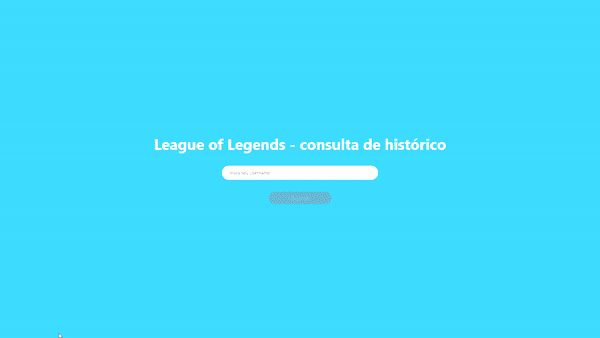

<h1>This Project isn't completely finished</h1>
<h4>This application was made using ReactJS with Typescript, Redux and also some features of the React Router Dom library</h4>

The core function of the application is to search for matches played by any league of legends player

For this, I have used the official RIOT GAMES Api to get all the necessary data.

An example of how the application is currently working can be found below in this readme.

